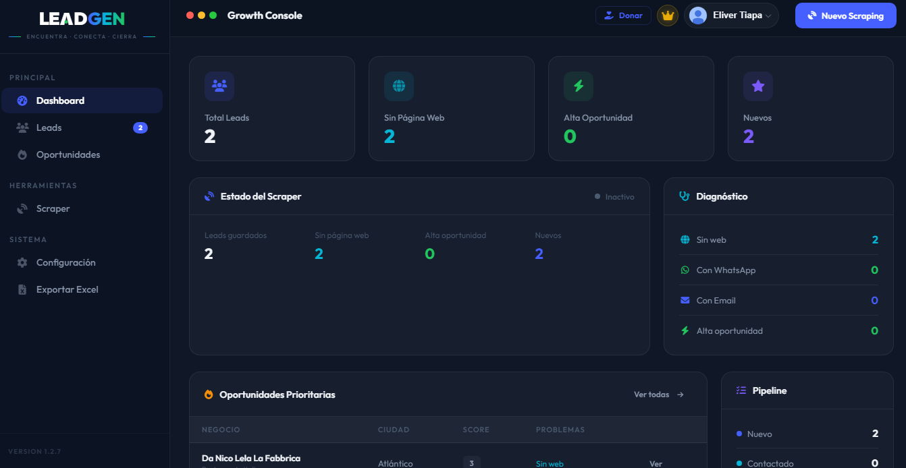

  

  <h1>🚀 LeadGen Platform</h1>
  
<strong>The Ultimate Free B2B Lead Generation Tool for Windows</strong>

  

    
    
    
  

  

    <a href="#-key-features">Key Features</a> •
    <a href="#-installation">Installation</a> •
    <a href="#-how-to-use">How to Use</a> •
    <a href="#-faq">FAQ</a>
  

  
  
<em>[ <a href="#-español">Ver versión en Español abajo</a> ]</em>

---

## 🌟 What is LeadGen?

**LeadGen** is a powerful, locally-hosted desktop application designed for B2B sales teams, marketing agencies, and freelancers. It completely automates the process of finding and qualifying potential clients directly from Google Maps and their official websites, providing real-time data to boost your sales pipeline.

Unlike other platforms, **LeadGen runs on your own machine**. There are no monthly subscriptions, no artificial search limits, and no credit cards required to use the core features.

## ✨ Key Features

- **🤖 Smart Scraper Engine:** Extracts business data (Name, Phone, Address, Reviews) simulating human behavior to avoid blocks. It guarantees exactly the number of leads you requested.
- **🌐 Deep Web Analysis:** Automatically visits business websites to find hidden email addresses and active social media links (Instagram, Facebook).
- **📊 Automatic Lead Diagnosis:** Automatically detects businesses without websites, no social media presence, or low ratings so you can offer web design, SEO, or marketing services immediately.
- **💬 100% Custom Messaging:** Integrated outreach generator. Set your own personalized pitch and the platform will generate custom WhatsApp links, Emails, and DMs in one click.
- **☁️ Cloud Sync (Premium):** Securely sync your CRM data across multiple devices using Firebase.
- **⚡ High-Performance UI:** Built with an instant, modern dashboard allowing you to manage your entire sales pipeline.

## 📥 Installation

1. Go to the [Releases page](https://github.com/david05klai/leadgen-public/releases/latest).
2. Download the latest `LeadGen-Setup-x.x.x.exe`.
3. Run the installer. *(If Windows SmartScreen warns you, click "More info" and "Run anyway" since the app is newly published).*
4. Open **LeadGen** from your desktop and start searching!

## 🚀 How to Use

1. **Set your Profile:** Go to Settings and configure your name and your custom pitch (e.g., "I help local businesses increase their traffic").
2. **Start a Search:** Click "New Scraping", enter a keyword (e.g., `Dentist`), a city (e.g., `Miami`), and how many leads you want.
3. **Filter:** You can choose to only find businesses *without* a website.
4. **Outreach:** Go to the Leads table, click on a lead, and click "Send WhatsApp" or "Send Email" to instantly contact them with your generated custom message.

## 💖 Support the Project (Donations)

If this software has helped you save time, automate your scraping, or boost your B2B sales pipeline, please consider supporting its continuous development! Any contribution is highly appreciated and helps keep the project active and regularly updated with new features.

You can donate securely via **PayPal**:

*   **PayPal Link:** [paypal.me/david05klai](https://paypal.me/david05klai)
*   **PayPal Email:** `eliverekisde09@gmail.com`

*Thank you so much for your support and for believing in this project!* 🚀

---

 

  <h1>🚀 LeadGen Platform (Español)</h1>
  
<strong>La herramienta definitiva de Generación de Leads B2B para Windows</strong>

**LeadGen** es una aplicación de escritorio diseñada para equipos de ventas B2B, agencias de marketing y freelancers. Automatiza el proceso de búsqueda y calificación de clientes potenciales directamente desde Google Maps, extrayendo datos valiosos para acelerar tus ventas.

## ✨ Características Principales

- **🤖 Scraper Inteligente:** Extrae datos simulando comportamiento humano. A diferencia de otras herramientas, LeadGen garantiza conseguir la cantidad exacta de leads que pediste.
- **🌐 Análisis Web Profundo:** Visita automáticamente las páginas web de los negocios para encontrar correos ocultos y enlaces a redes sociales.
- **📊 Diagnóstico Automático:** Detecta al instante si un negocio no tiene sitio web, tiene malas reseñas o no usa redes sociales, ideal para vender servicios digitales.
- **💬 Mensajes 100% Personalizados:** Genera enlaces listos para enviar por WhatsApp, Email y Redes Sociales usando tu propio "pitch" de ventas.
- **⚡ CRM Integrado:** Organiza a tus clientes potenciales, cambia sus estados (Contactado, Interesado, Cerrado) y expórtalos a Excel.

## 📥 Instalación

1. Ve a la página de [Releases](https://github.com/david05klai/leadgen-public/releases/latest).
2. Descarga el archivo `LeadGen-Setup-x.x.x.exe` más reciente.
3. Ejecuta el instalador. *(Si Windows SmartScreen muestra una advertencia, haz clic en "Más información" y luego en "Ejecutar de todas formas").*
4. ¡Abre **LeadGen** y comienza a conseguir clientes!

## 🐛 Soporte y Errores
Si encuentras un error o tienes sugerencias, por favor abre un [Issue](https://github.com/david05klai/leadgen-public/issues) en este repositorio.

---

## 💖 Apoya el Proyecto (Donaciones)

Si este software te ha sido de utilidad para ahorrar tiempo, automatizar tu prospección o impulsar tus ventas B2B, ¡considera apoyar su desarrollo continuo! Cualquier contribución es enormemente apreciada y ayuda a mantener el proyecto activo y al día con nuevas características.

Puedes realizar tu donación de forma segura a través de **PayPal**:

*   **Enlace de PayPal:** [paypal.me/david05klai](https://paypal.me/david05klai)
*   **Correo de contacto/donación:** `eliverekisde09@gmail.com`

*¡Muchísimas gracias por tu apoyo y por creer en este proyecto!* 🚀

